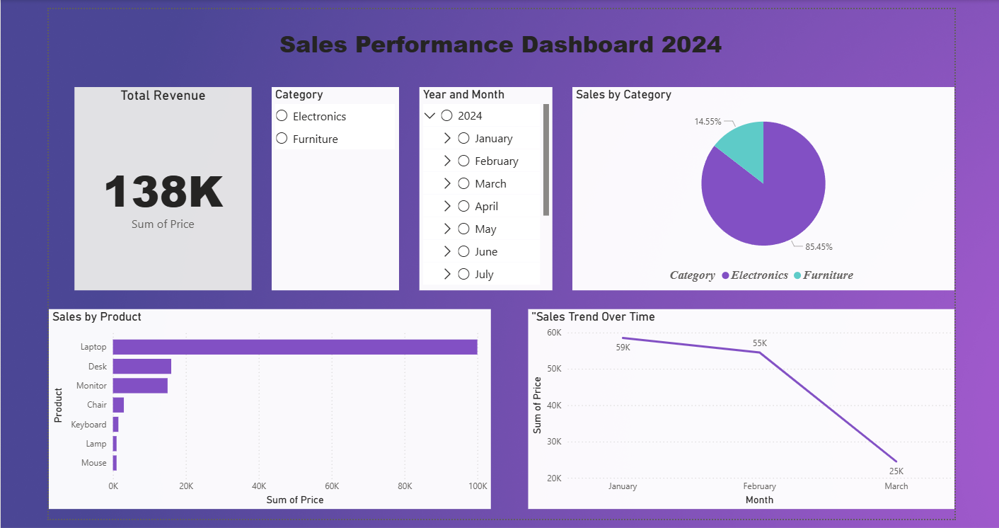

# 📊 Data Analyst Portfolio

Welcome to my data analysis portfolio! I'm an aspiring data analyst passionate about transforming data into actionable insights.

## 🎯 About Me
Currently completing a comprehensive Data Analysis certification covering:
- **Data Analysis:** Statistics, Advanced Analytics, Predictive Analytics
- **Visualization:** Power BI, Tableau, Business Intelligence
- **Programming:** Python (Pandas, NumPy, Matplotlib), SQL, MongoDB
- **Tools:** Excel, Jupyter Notebook, Big Data foundations

## 📁 Projects

### 1. 📈 [Sales Performance Dashboard](./01-sales-dashboard)
**Tools:** Power BI | Excel  
**Completion:** December 2025

Interactive dashboard analyzing sales trends, product performance, and category distribution.

**Highlights:**
- Built interactive Power BI dashboard with dynamic slicers
- Analyzed 138K in revenue across 10 transactions
- Identified 55% sales decline trend requiring strategic attention
- Created clear visualizations for executive decision-making

**Key Metrics:**
- Total Revenue: 138K
- Top Product: Laptop (100K)
- Category Leadership: Electronics (85.45%)

[View Project Details →](./01-sales-dashboard)



---

## 🛠️ Technical Skills

**Data Visualization:**
- Power BI (Interactive Dashboards, DAX)
- Tableau
- Excel (Advanced Formulas, Pivot Tables, Power Query)

**Programming & Databases:**
- Python: Pandas, NumPy, Matplotlib, Seaborn
- SQL: Complex Queries, JOINs, Aggregations
- MongoDB basics

**Analysis Techniques:**
- Statistical Analysis
- Predictive Analytics
- Machine Learning fundamentals
- Business Intelligence

**Tools & Platforms:**
- Jupyter Notebook
- Git & GitHub
- Microsoft Excel
- Data Cleaning & Transformation

---

## 📚 Current Learning
- Completing Data Analysis certification (Jan 2026)
- Building portfolio projects
- Preparing for data analyst roles

## 📫 Connect With Me

- **Email:** sakshibirendra1028@gmail.com
- **LinkedIn:** https://www.linkedin.com/in/sakshi-mahto/
- **Location:** Pune, Maharashtra, India


## 🚀 More Projects Coming Soon!
- E-commerce Sales Analysis (SQL + Python + Power BI)
- Customer Churn Prediction (Python + Machine Learning)
- Financial Performance Dashboard (Excel + Power BI)

---

*This portfolio is actively maintained and updated with new projects regularly.*
```
